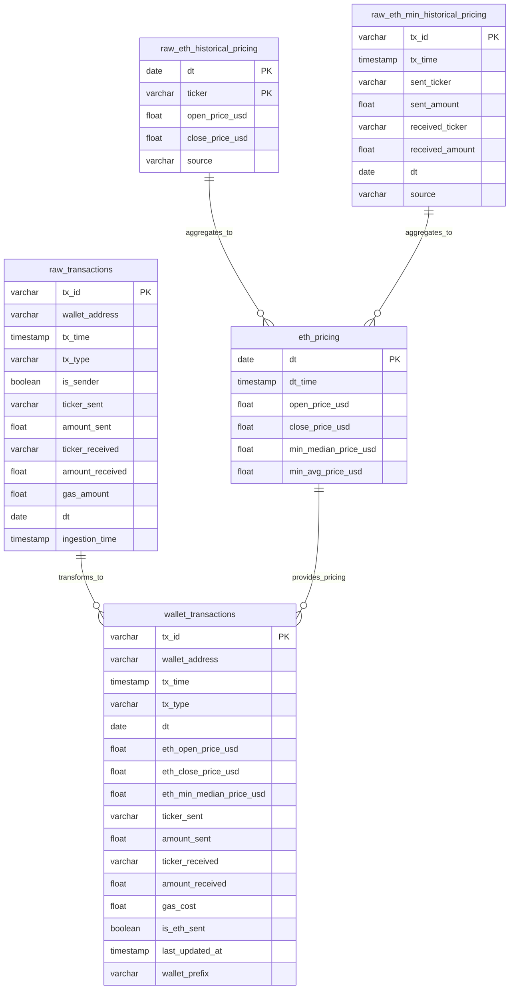
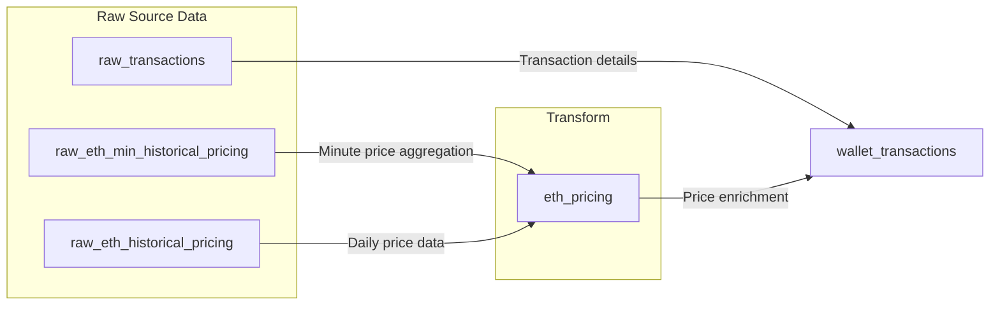

# Data Project Specification

## Project Overview
- **Project Name**: Wallet Transaction Accounting Tool
- **Description**: A tool designed to simplify the accounting of Ethereum-based transactions, including detailed tracking of gas fees. This project allows users to accurately calculate the cost basis, track proceeds, and categorize expenses associated with buying, selling, and transferring assets on the Ethereum blockchain for easy export for accountants.
- **Owner**: Johnny Chan
- **Last Updated**: 11/9/2024

### Source Data Schemas
```sql
-- Historical USDC/T Price Swaps (Minute accurate pricing)
CREATE TABLE raw_eth_min_historical_pricing (
    tx_id VARCHAR,
    tx_time TIMESTAMP(0),
    sent_ticker VARCHAR,
    sent_amount FLOAT,
    received_ticker VARCHAR,
    received_amount FLOAT,
    dt DATE,
    source VARCHAR
)
WITH (
    format = 'PARQUET',
    partitioning = ARRAY['dt']
)
```

```sql
-- Historical Price Open/Close (Coingecko)
CREATE TABLE raw_eth_historical_pricing (
    dt DATE,
    ticker VARCHAR,
    open_price_usd FLOAT,
    close_price_usd FLOAT,
    source VARCHAR
)
WITH (
    format = 'PARQUET',
)
```

```sql
--- Raw Wallet Transactions
CREATE TABLE raw_transactions (
    wallet_address VARCHAR,
    tx_id VARCHAR PRIMARY,
    tx_time TIMESTAMP(0),
    tx_type VARCHAR,
    is_sender BOOLEAN,
    ticker_sent VARCHAR,
    amount_sent FLOAT,
    ticker_received VARCHAR,
    amount_received FLOAT,
    gas_amount FLOAT,
    dt DATE,
    ingestion_time TIMESTAMP(0)  -- Add processing metadata
)
WITH (
    format = 'PARQUET',
    partitioning = ARRAY['dt', 'ticker_main']
)
```

### Transformed Data Schemas
```sql
-- Historic ETH pricing table
CREATE TABLE eth_pricing (
    dt DATE,
    dt_time TIMESTAMP(0),
    open_price_usd FLOAT,
    close_price_usd FLOAT,
    min_median_price_usd FLOAT,
    min_avg_price_usd FLOAT,
)
WITH (
    format = 'PARQUET',
    partitioning = ARRAY['dt']
)
```
```sql
-- Final Schema
CREATE TABLE wallet_transactions (
    wallet_address VARCHAR,
    tx_id VARCHAR,           -- Add to trace back to raw
    tx_time TIMESTAMP(0),
    tx_type VARCHAR,
    dt DATE,
    eth_open_price_usd FLOAT,
    eth_close_price_usd FLOAT,
    eth_min_median_price_usd FLOAT,
    ticker_sent VARCHAR,
    amount_sent FLOAT,
    ticker_received VARCHAR,
    amount_received FLOAT,
    gas_cost FLOAT,
    is_eth_sent BOOLEAN,
    last_updated_at TIMESTAMP(0),
    wallet_prefix VARCHAR -- 0xXX
)
WITH (
    format = 'PARQUET',
    partitioning = ARRAY['dt','wallet_prefix']
)
```

### Data Model Diagram


### DAG Structure


### Processing Steps
1. Raw Pricing Data
   - Frequency: Hourly
   - Source: Uniswap v2 and v3 USDC/T Swap Transactions
   - Target: S3 Bucket
2. Raw Daily Pricing Data
   - Frequency: Daily
   - Source: Coingecko API
   - Target S3 Bucket

2. Wallet Transactions
   - Frequency: On-Demand + (Potential periodic scan)
   - Source: Infura/Alchemy Node
   - Target: S3 Bucket

2. Transform 
   - Pricing Data (ETH)
    - Aggregation
    - Price enrichment
    - Calculations
   - Wallet Transactions
    - Enrichment

3. Quality Checks
   - Schema validation
   - Data quality metrics

### Data Quality Framework
```python
quality_checks = {
    'completeness': {
        # Transaction checks
        'raw_tx_completeness': '''
            SELECT dt,
                COUNT(CASE WHEN tx_id IS NULL THEN 1 END) / COUNT(*) as missing_tx_id,
                COUNT(CASE WHEN wallet_address IS NULL THEN 1 END) / COUNT(*) as missing_wallet,
                COUNT(CASE WHEN tx_time IS NULL THEN 1 END) / COUNT(*) as missing_time
            FROM raw_transactions
            GROUP BY dt
        ''',
        
        # Pricing Data checks
        'price_completeness': '''
            SELECT dt,
                COUNT(CASE WHEN open_price_usd IS NULL THEN 1 END) / COUNT(*) as missing_open,
                COUNT(CASE WHEN close_price_usd IS NULL THEN 1 END) / COUNT(*) as missing_close
            FROM raw_eth_historical_pricing
            GROUP BY dt
        '''
    },
    
    'accuracy': {
        # Transaction amount checks
        'transaction_accuracy': '''
            SELECT dt,
                COUNT(CASE WHEN amount_sent < 0 THEN 1 END) / COUNT(*) as negative_sends,
                COUNT(CASE WHEN amount_received < 0 THEN 1 END) / COUNT(*) as negative_receives,
                COUNT(CASE WHEN gas_amount < 0 THEN 1 END) / COUNT(*) as negative_gas
            FROM raw_transactions
            GROUP BY dt
        '''
    }
}
```

### Quality Thresholds
| Metric | Threshold | Severity |
|--------|-----------|----------|
| Missing Values | < 5% | Critical |
| Negative Values | < 1% | Critical |

### Infrastructure
#### Storage
- Raw: `s3`
- Processed: `s3://bucket/processed/`
- File Format: Parquet

### Processing
- Trino

### Monitoring
- Data Freshness: < 24 hours
- Pipeline Duration: < 1 hour
- Quality Score: > 95%

### Alerts
| Alert | Condition | Channel |
|-------|-----------|---------|
| Late Data | lag > 24 hours | Email |
| Quality Failed | score < 95% | Email |
| Pipeline Failed | status = 'FAILED' | Email |

### Dependencies
- External Systems
- APIs
- Libraries
- Credentials

### Troubleshooting
- Common Issues
- Resolution Steps
- Support Contacts
