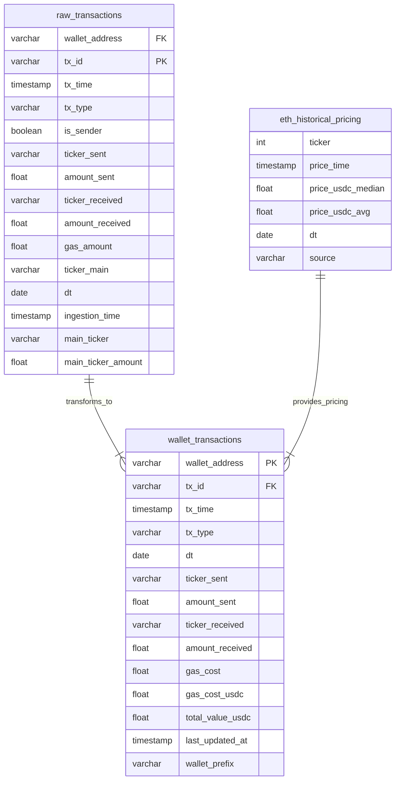
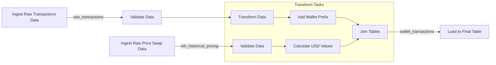

# Data Project Specification

## Project Overview
- **Project Name**: Wallet Transaction Accounting Tool
- **Description**: A comprehensive tool designed to simplify the accounting of Ethereum-based transactions, including detailed tracking of gas fees. This project allows users to accurately calculate the cost basis, track proceeds, and categorize expenses associated with buying, selling, and transferring assets on the Ethereum blockchain for easy export for accountants.
- **Owner**: Johnny Chan
- **Last Updated**: 11/9/2024

### Source Data Schemas
```sql
-- Historical USDC Price Swaps (Minute accurate pricing)
CREATE TABLE raw_eth_min_historical_pricing (
    tx_id VARCHAR,
    tx_time TIMESTAMP(0),
    sent_ticker VARCHAR,
    sent_amount FLOAT,
    received_ticker VARCHAR,
    received_amount FLOAT,
    dt DATE,
    source VARCHAR
)
WITH (
    format = 'PARQUET',
    partitioning = ARRAY['dt']
)
```

```sql
-- Historical Price Open/Close (Coingecko)
CREATE TABLE raw_eth_historical_pricing (
    dt DATE,
    ticker VARCHAR,
    open_price_usd FLOAT,
    close_price_usd FLOAT,
    source VARCHAR
)
WITH (
    format = 'PARQUET',
)
```

```sql
--- Raw Wallet Transactions
CREATE TABLE raw_transactions (
    wallet_address VARCHAR,
    tx_id VARCHAR PRIMARY,
    tx_time TIMESTAMP(0),
    tx_type VARCHAR,
    is_sender BOOLEAN,
    ticker_sent VARCHAR,
    amount_sent FLOAT,
    ticker_received VARCHAR,
    amount_received FLOAT,
    gas_amount FLOAT,
    ticker_main VARCHAR,
    dt DATE,
    ingestion_time TIMESTAMP(0)  -- Add processing metadata
)
WITH (
    format = 'PARQUET',
    partitioning = ARRAY['dt', 'ticker_main']
)
```

### Transformed Data Schemas
```sql
-- Historic ETH pricing table
CREATE TABLE eth_pricing (
    dt DATE,
    dt_time TIMESTAMP(0),
    open_price_usd FLOAT,
    close_price_usd FLOAT,
    min_median_price_usdc FLOAT,
    min_avg_price_usdc FLOAT,
)
WITH (
    format = 'PARQUET',
    partitioning = ARRAY['dt']
)
```
```sql
-- Final Schema
CREATE TABLE wallet_transactions (
    wallet_address VARCHAR,
    tx_id VARCHAR,           -- Add to trace back to raw
    tx_time TIMESTAMP(0),
    tx_type VARCHAR,
    dt DATE,
    eth_open_price_usd FLOAT,
    eth_close_price_usd FLOAT,
    eth_min_median_price_usdc FLOAT,
    ticker_sent VARCHAR,
    amount_sent FLOAT,
    ticker_received VARCHAR,
    amount_received FLOAT,
    gas_cost FLOAT,
    is_eth_sent BOOLEAN,
    last_updated_at TIMESTAMP(0),
    wallet_prefix VARCHAR -- 0xXX
)
WITH (
    format = 'PARQUET',
    partitioning = ARRAY['dt','wallet_prefix']
)
```

### Data Model Diagram


### DAG Structure


### Processing Steps
1. Raw Pricing Data
   - Frequency: Hourly
   - Source: Uniswap v2 and v3 USDC Swap Transactions
   - Target: S3 Bucket

2. Wallet Transactions
   - Frequency: On-Demand + (Potential periodic scan)
   - Source: Infura/Alchemy Node
   - Target: S3 Bucket

2. Transform 
   - Pricing Data (ETH)
    - Aggregation (Aggregating all swap prices by minute)
    - Calculations (Median price to reduce outliers as best as possible/Can add AVG as a column as well)
   - Wallet Transactions
    - Enrichments (Wallet prefix)
    - Calculations (Is_sender logic to join on ETH)

3. Quality Checks
   - Schema validation
   - Business rule validation
   - Data quality metrics

## 4. Data Quality Framework
### 4.1 Quality Metrics
```python
quality_checks = {
    'completeness': {
        'missing_values': 'count(case when col is null then 1 end) / count(*)',
        'empty_strings': 'count(case when col = "" then 1 end) / count(*)'
    },
    'accuracy': {
        'value_range': 'count(case when value between 0 and 100 then 1 end) / count(*)',
        'valid_categories': 'count(case when category in ("A", "B", "C") then 1 end) / count(*)'
    },
    'timeliness': {
        'processing_lag': 'avg(timestamp_diff(process_time, event_time, HOUR))'
    }
}
```

### 4.2 Quality Thresholds
| Metric | Threshold | Severity |
|--------|-----------|----------|
| Missing Values | < 5% | Critical |
| Value Range | > 95% | Warning |
| Processing Lag | < 2 hours | Critical |

## 5. Infrastructure
### 5.1 Storage
- Raw Zone: `s3://bucket/raw/`
- Processed Zone: `s3://bucket/processed/`
- File Format: Parquet
- Partitioning Strategy: Daily partitions

### 5.2 Processing
- Engine: Spark/Trino
- Resource Configuration:
  ```yaml
  spark:
    executor.instances: 4
    executor.memory: 8g
    executor.cores: 4
  ```

## 6. Monitoring
### 6.1 SLAs
- Data Freshness: < 3 hours
- Pipeline Duration: < 1 hour
- Quality Score: > 95%

### 6.2 Alerts
| Alert | Condition | Channel |
|-------|-----------|---------|
| Late Data | lag > 3 hours | Slack #data-alerts |
| Quality Failed | score < 95% | Email + Slack |
| Pipeline Failed | status = 'FAILED' | PagerDuty |

## 7. Testing Strategy
### 7.1 Unit Tests
```python
def test_data_quality():
    # Test completeness
    assert check_missing_values(df) < 0.05
    # Test accuracy
    assert check_value_ranges(df) > 0.95
```

### 7.2 Integration Tests
- End-to-end pipeline validation
- Cross-system data consistency
- Performance benchmarks

## 8. Dependencies
- External Systems
- APIs
- Libraries
- Credentials

## 9. Runbook
### 9.1 Pipeline Operation
```bash
# Example commands
spark-submit job.py --date 2024-01-01
```

### 9.2 Troubleshooting
- Common Issues
- Resolution Steps
- Support Contacts
