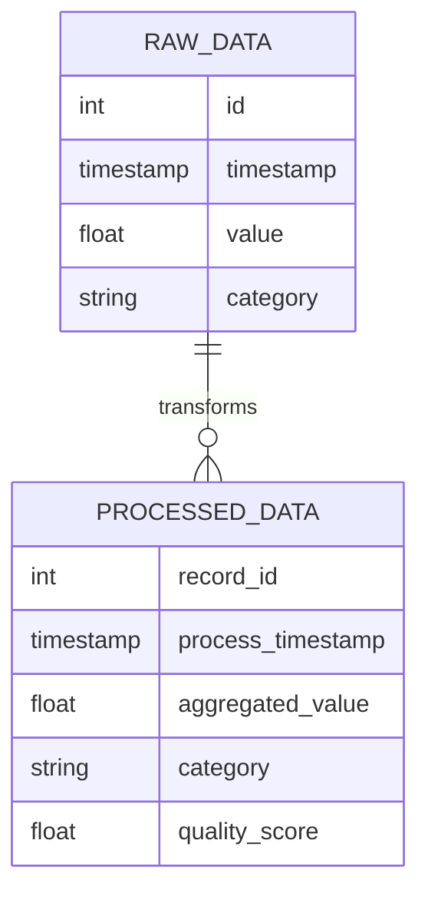
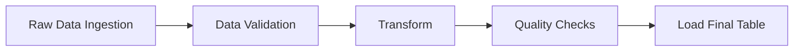

# Data Project Specification

## 1. Project Overview
- **Project Name**: [Name]
- **Description**: Brief description of project goals and business value
- **Owner**: [Name/Team]
- **Last Updated**: [Date]

## 2. Data Model
### 2.1 Source Data Schemas
```sql
-- Example Raw Data Schema
CREATE TABLE raw_data (
    id INT,
    timestamp TIMESTAMP,
    value FLOAT,
    category STRING,
    metadata MAP<STRING, STRING>
)
USING iceberg
PARTITIONED BY (days(timestamp));
```

### 2.2 Transformed Data Schemas
```sql
-- Example Final Table Schema
CREATE TABLE processed_data (
    record_id INT,
    process_timestamp TIMESTAMP,
    aggregated_value FLOAT,
    category STRING,
    quality_score FLOAT
)
USING iceberg
PARTITIONED BY (month(process_timestamp));
```

### 2.3 Data Model Diagram


## 3. Data Pipeline
### 3.1 DAG Structure


### 3.2 Processing Steps
1. Raw Data Ingestion
   - Frequency: Hourly
   - Source: [Source System]
   - Target: S3 raw zone

2. Transform
   - Aggregations
   - Enrichments
   - Calculations

3. Quality Checks
   - Schema validation
   - Business rule validation
   - Data quality metrics

## 4. Data Quality Framework
### 4.1 Quality Metrics
```python
quality_checks = {
    'completeness': {
        'missing_values': 'count(case when col is null then 1 end) / count(*)',
        'empty_strings': 'count(case when col = "" then 1 end) / count(*)'
    },
    'accuracy': {
        'value_range': 'count(case when value between 0 and 100 then 1 end) / count(*)',
        'valid_categories': 'count(case when category in ("A", "B", "C") then 1 end) / count(*)'
    },
    'timeliness': {
        'processing_lag': 'avg(timestamp_diff(process_time, event_time, HOUR))'
    }
}
```

### 4.2 Quality Thresholds
| Metric | Threshold | Severity |
|--------|-----------|----------|
| Missing Values | < 5% | Critical |
| Value Range | > 95% | Warning |
| Processing Lag | < 2 hours | Critical |

## 5. Infrastructure
### 5.1 Storage
- Raw Zone: `s3://bucket/raw/`
- Processed Zone: `s3://bucket/processed/`
- File Format: Parquet
- Partitioning Strategy: Daily partitions

### 5.2 Processing
- Engine: Spark/Trino
- Resource Configuration:
  ```yaml
  spark:
    executor.instances: 4
    executor.memory: 8g
    executor.cores: 4
  ```

## 6. Monitoring
### 6.1 SLAs
- Data Freshness: < 3 hours
- Pipeline Duration: < 1 hour
- Quality Score: > 95%

### 6.2 Alerts
| Alert | Condition | Channel |
|-------|-----------|---------|
| Late Data | lag > 3 hours | Slack #data-alerts |
| Quality Failed | score < 95% | Email + Slack |
| Pipeline Failed | status = 'FAILED' | PagerDuty |

## 7. Testing Strategy
### 7.1 Unit Tests
```python
def test_data_quality():
    # Test completeness
    assert check_missing_values(df) < 0.05
    # Test accuracy
    assert check_value_ranges(df) > 0.95
```

### 7.2 Integration Tests
- End-to-end pipeline validation
- Cross-system data consistency
- Performance benchmarks

## 8. Dependencies
- External Systems
- APIs
- Libraries
- Credentials

## 9. Runbook
### 9.1 Pipeline Operation
```bash
# Example commands
spark-submit job.py --date 2024-01-01
```

### 9.2 Troubleshooting
- Common Issues
- Resolution Steps
- Support Contacts
