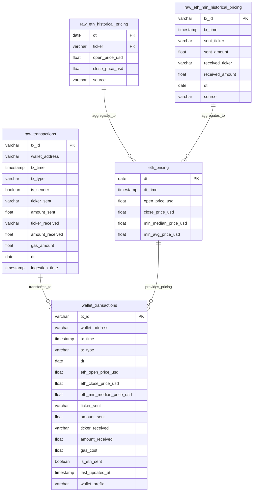
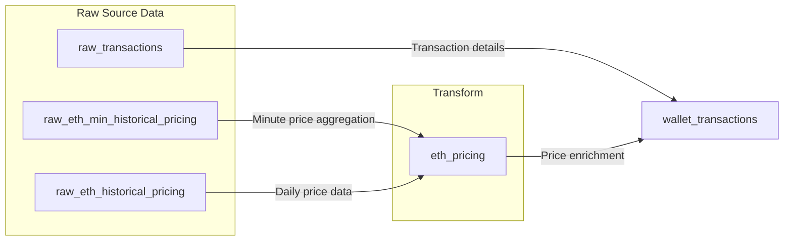

# Web3 Eth Wallet Insights Analytics Engineering Pipeline

# 1. Data Project Specification

## Project Overview

- **Project Name**: Wallet Transaction Accounting Tool
- **Description**: A tool designed to simplify the accounting of Ethereum-based transactions, including detailed tracking of gas fees. This project allows users to accurately calculate the cost basis, track proceeds, and categorize expenses associated with buying, selling, and transferring assets on the Ethereum blockchain for easy export for accountants.
- **Owner**: Johnny Chan

### Source Data Schemas

```sql
-- Historical USDC/T Price Swaps (Minute accurate pricing)
CREATE TABLE raw_eth_min_historical_pricing (
    tx_id VARCHAR,
    tx_time TIMESTAMP(0),
    sent_ticker VARCHAR,
    sent_amount FLOAT,
    received_ticker VARCHAR,
    received_amount FLOAT,
    dt DATE,
    source VARCHAR
)
WITH (
    format = 'PARQUET',
    partitioning = ARRAY['dt']
)

```

```sql
-- Historical Price Open/Close (Coingecko)
CREATE TABLE raw_eth_historical_pricing (
    dt DATE,
    ticker VARCHAR,
    open_price_usd FLOAT,
    close_price_usd FLOAT,
    source VARCHAR
)
WITH (
    format = 'PARQUET',
)

```

```sql
--- Raw Wallet Transactions
CREATE TABLE raw_transactions (
    wallet_address VARCHAR,
    tx_id VARCHAR PRIMARY,
    tx_time TIMESTAMP(0),
    tx_type VARCHAR,
    is_sender BOOLEAN,
    ticker_sent VARCHAR,
    amount_sent FLOAT,
    ticker_received VARCHAR,
    amount_received FLOAT,
    gas_amount FLOAT,
    dt DATE,
    ingestion_time TIMESTAMP(0)  -- Add processing metadata
)
WITH (
    format = 'PARQUET',
    partitioning = ARRAY['dt', 'ticker_main']
)

```

### Transformed Data Schemas

```sql
-- Historic ETH pricing table
CREATE TABLE eth_pricing (
    dt DATE,
    dt_time TIMESTAMP(0),
    open_price_usd FLOAT,
    close_price_usd FLOAT,
    min_median_price_usd FLOAT,
    min_avg_price_usd FLOAT,
)
WITH (
    format = 'PARQUET',
    partitioning = ARRAY['dt']
)

```

```sql
-- Final Schema
CREATE TABLE wallet_transactions (
    wallet_address VARCHAR,
    tx_id VARCHAR,           -- Add to trace back to raw
    tx_time TIMESTAMP(0),
    tx_type VARCHAR,
    dt DATE,
    eth_open_price_usd FLOAT,
    eth_close_price_usd FLOAT,
    eth_min_median_price_usd FLOAT,
    ticker_sent VARCHAR,
    amount_sent FLOAT,
    ticker_received VARCHAR,
    amount_received FLOAT,
    gas_cost FLOAT,
    is_eth_sent BOOLEAN,
    last_updated_at TIMESTAMP(0),
    wallet_prefix VARCHAR -- 0xXX
)
WITH (
    format = 'PARQUET',
    partitioning = ARRAY['dt','wallet_prefix']
)

```

### Data Model Diagram



### DAG Structure



### Processing Steps

1. Raw Pricing Data
    - Frequency: Hourly
    - Source: Uniswap v2 and v3 USDC/T Swap Transactions
    - Target: S3 Bucket
2. Raw Daily Pricing Data
    - Frequency: Daily
    - Source: Coingecko API
    - Target S3 Bucket
3. Wallet Transactions
    - Frequency: On-Demand + (Potential periodic scan)
    - Source: Infura/Alchemy Node
    - Target: S3 Bucket
4. Transform
    - Pricing Data (ETH)
    - Aggregation
    - Price enrichment
    - Calculations
    - Wallet Transactions
    - Enrichment
5. Quality Checks
    - Schema validation
    - Data quality metrics

### Data Quality Framework

```python
quality_checks = {
    'completeness': {
        # Transaction checks
        'raw_tx_completeness': '''
            SELECT dt,
                COUNT(CASE WHEN tx_id IS NULL THEN 1 END) / COUNT(*) as missing_tx_id,
                COUNT(CASE WHEN wallet_address IS NULL THEN 1 END) / COUNT(*) as missing_wallet,
                COUNT(CASE WHEN tx_time IS NULL THEN 1 END) / COUNT(*) as missing_time
            FROM raw_transactions
            GROUP BY dt
        ''',

        # Pricing Data checks
        'price_completeness': '''
            SELECT dt,
                COUNT(CASE WHEN open_price_usd IS NULL THEN 1 END) / COUNT(*) as missing_open,
                COUNT(CASE WHEN close_price_usd IS NULL THEN 1 END) / COUNT(*) as missing_close
            FROM raw_eth_historical_pricing
            GROUP BY dt
        '''
    },

    'accuracy': {
        # Transaction amount checks
        'transaction_accuracy': '''
            SELECT dt,
                COUNT(CASE WHEN amount_sent < 0 THEN 1 END) / COUNT(*) as negative_sends,
                COUNT(CASE WHEN amount_received < 0 THEN 1 END) / COUNT(*) as negative_receives,
                COUNT(CASE WHEN gas_amount < 0 THEN 1 END) / COUNT(*) as negative_gas
            FROM raw_transactions
            GROUP BY dt
        '''
    }
}

```

### Quality Thresholds

| Metric | Threshold | Severity |
| --- | --- | --- |
| Missing Values | < 5% | Critical |
| Negative Values | < 1% | Critical |

### Infrastructure

### Storage

- Raw: `s3`
- Processed: `s3://bucket/processed/`
- File Format: Parquet

### Processing

- Trino

### Monitoring

- Data Freshness: < 24 hours
- Pipeline Duration: < 1 hour
- Quality Score: > 95%

### Alerts

| Alert | Condition | Channel |
| --- | --- | --- |
| Late Data | lag > 24 hours | Email |
| Quality Failed | score < 95% | Email |
| Pipeline Failed | status = 'FAILED' | Email |

### Dependencies

- External Systems
- APIs
- Libraries
- Credentials

### Troubleshooting

- Common Issues
- Resolution Steps
- Support Contacts

---

# 2. Write Up - Purpose

I had a few friends who had to file taxes for crypto and nft trading the last couple of years. One of the biggest pain points they had were reconciling all of their transactions and figuring out where everything is going and what these transactions were for. So this idea spawned from trying to help users understand their transactions and process it and allow them to export it as a csv in a tax/accountant friendly format so they can remove the headache when tax season comes around.

### Initial ideation and plan:

1. Get crypto pricing data + wallet transaction data into s3 bucket
2. Layer in iceberg for metadata and query using trino
3. DBT to transform and join all the data into a master wallet_transactions table in a separate production postgres db
4. Surface data visualizations in a web_app (flask because I’ve done some flask work in the past)

### Datasets and sources

- Coingecko API for daily open and close prices
- Scrape all Uniswap ETH/WETH <> Stablecoin pairs and aggregate median ETH price by minute to get as granular as possible (Alchemy node)
- Scraped a user provided wallet address for all their transactions (Alchemy node)

### Technology choices

- Python
- AWS
    - S3 storage
    - AWS Glue
    - AWS Athena
- DBT
- Airflow
- Docker
- DigitalOcean
    - Droplets
    - Postgres

### What actually ended up happening:

1. Wallet transaction data was by far one of the most annoying parts of this whole process. Crypto data is just nasty to work with the vast amounts of transactions and different functions and contracts just makes parsing transactions near impossible. Different transaction types like a NORMAL transfer vs an ERC20 token transfer passes in different data logs which was I spent 2 full days trying to parse and stuck with just NORMAL transactions only.
2. Created a script to scrape every single block for the last 2 years to get every ETH <> Stablecoin transaction so that I could get as granular as I could so that the transaction data would be super accurate. The amount of time it takes for my script to process 1 block of eth transactions is longer than an eth block being generated so I will always fall behind in terms of real time pricing. I ended up backfilling all the minute data with the open and close price average instead because it would take my script 7000 days to scrape every block. What I later found out, Alchemy has historic pricing data for ETH but in 5 minute intervals so maybe I’ll end up doing that in future iterations
3. I stored all of the data after scraping as parquet files in an S3 bucket. I had AWS Glue crawlers apply metadata to my datasets and generate tables, but what I didn’t know was that they stayed as parquet files and didn’t apply an Iceberg table format to my files. For this reason Trino was not able to query directly on my s3 files since they stayed as parquet formats and not Iceberg tables. The quickest workaround was to just use AWS Athena as my query engine.
4. I used DBT to seed the daily open and close prices as a csv since I was only going back 2 years worth of data which was only ~800 rows of data I didn’t think it needed to be stored in s3. I created staging models to combine daily ETH data with the minute level data as well as fill in all missing minutes and minute pricing data. Created a staging wallets_transactions table and applied data quality checks to make sure all transaction hashes are unique and then just did a production table using this staging table.
5. Airflow used to run the DBT models as a dbt_bash DAG. I didn’t know DBT couldn’t run models on one database (Athena) and then transfer that data and generate materialized tables to another database (Postgres), so I wrote a quick script as a DAG to copy and paste the final production table to Postgres.
6. I put together some FastAPI apps to handle communication between my Flask frontend and querying Postgres for data to surface my visualizations. Used Chart.js because I found a tutorial and it seemed easiest to implement visualizations. Added some basic filters and visualizations to my Flask app.
7. Getting Docker to work on certain pieces of my process was a headache and a pain in the ass. When adjusting code and certain elements in a docker container I didn’t realize that cache existed and I was confused for a while as to why certain things weren’t working the way they should’ve

### Future Enhancements:

1. Improve wallet transaction parsing + Including token transfer transactions(ERC20, ERC1155) + Internal transactions
2. Use Alchemy’s 5 min interval pricing instead of minute pricing (Don’t think it matters as much as I had initially thought for the amount of effort)
3. Understanding the intervals and timings on when to run my Airflow schedules, right now I run it manually + Adding the scraping scripts into Airflow to automate
4. More sophisticated  Data Quality checks, very simple unique and non null checks only
5. Containerizing more parts of the code and getting more familiar with the Docker stack
6. Creating more sophisticated queries and displaying more advanced data visualizations and front-end in general

---

# ETL Code:

`eth_daily_prices.py` :

```python
import requests
import os
import pandas as pd
from datetime import datetime, date, timedelta
import time
import shutil

today = datetime.now().date()
api_key = '{api-key}'

headers = {
    "accept": "application/json",
    "content-type": "application/json"
}

#Creating CSV if it doesnt exist
file_path = r"../seeds/open_close_price.csv"
destination = r"../db_working_folder/dbtathena/seeds/open_close_price.csv"
if not os.path.exists(file_path):
    os.makedirs(os.path.dirname(file_path), exist_ok=True)
    # Create with lowercase column names to match the rest of the code
    df = pd.DataFrame(columns=['date', 'open', 'close'])
    df.to_csv(file_path, index=False)

def find_missing_dates(file_path):
    try:
        default_start = pd.Timestamp('2023-01-01')
        
        df = pd.read_csv(file_path)
        
        # Convert column names to lowercase
        df.columns = df.columns.str.lower()
        
        if df.empty or 'date' not in df.columns:
            min_date = default_start
        else:
            df['date'] = pd.to_datetime(df['date'])
            min_date = df['date'].min()
            if pd.isna(min_date):
                min_date = default_start
        
        current_date = pd.Timestamp.now().date()
        date_range = pd.date_range(start=min_date.date(), end=current_date, freq='D')
        existing_dates = set(df['date'].dt.date) if not df.empty and 'date' in df.columns else set()
        missing_dates = [date.date() for date in date_range if date.date() not in existing_dates]
        
        return missing_dates
    
    except Exception as e:
        print(f"Error: {e}")
        return None

def get_prices(request_date):
    url = f"https://api.polygon.io/v1/open-close/crypto/ETH/USD/{request_date}?adjusted=true&apiKey={api_key}"
    response = requests.get(url).json()
    pd_date = pd.to_datetime(response['day']).date()
    return {
        'date': pd_date,
        'open': response['open'],
        'close': response['close']
    }

def append_rows(file_path, new_rows):
    try:
        # Create DataFrame with explicit column names
        df_new = pd.DataFrame(new_rows, columns=['date', 'open', 'close'])
        
        # Read existing CSV with lowercase columns
        df = pd.read_csv(file_path)
        df.columns = df.columns.str.lower()
        
        # Concatenate and save
        df = pd.concat([df, df_new], ignore_index=True)
        df.to_csv(file_path, index=False)
        print("Data appended successfully")
    except Exception as e:
        print(f"Error appending data: {e}")

dates = find_missing_dates(file_path)
while len(dates) != 1:  #Last date should be current date since there is no closing price for this yet..
    rows_to_insert = []
    range_length = 5
    if len(dates) < 5:
        range_length = len(dates) -1
    else:
        pass
    try:
        for i in range(range_length):  
            new_row = get_prices(dates[0])
            rows_to_insert.append(new_row)
            dates.pop(0)
        append_rows(file_path, rows_to_insert)
        try:
            shutil.copy(file_path,destination)
            print('Copy Success')
        except Exception as e:
            print(f'Ran into {e}')
        time.sleep(302)  # Add delay for api limits
    except IndexError:
        break

print(f'Script complete with {dates} remaining')
```

`eth_stables_scraper.py`

```python
from web3 import Web3
import asyncio
import os
from datetime import datetime, timedelta
import pandas as pd
from eth_abi.abi import decode
from eth_utils import decode_hex
from typing import List, Dict, Optional
from constants import DEX_LIST
import boto3
from dotenv import load_dotenv
load_dotenv("../.env")
import logging

# Environmental setup and constants
# API URLs for Ethereum nodes
inf_url = os.getenv('inf_url')
alc_url = os.getenv('alc_url')

# Calculate start of current week in Unix timestamp
week_start = datetime.now() - timedelta(days=datetime.now().weekday())
week_start = int((week_start.replace(hour=0, minute=0, second=0, microsecond=0)).timestamp())

# Configure logging
logging.basicConfig(level=logging.INFO)
logger = logging.getLogger(__name__)

# S3 Configuration
S3_BUCKET = "eth-pricing-parquet-bucket"  # Replace with your bucket name
S3_PREFIX = "eth-minute-data-raw"       # Optional prefix for organizing files

# S3 Configuration for storing parquet files
class S3Uploader:
    """
    Handles uploading files to S3 with versioning enabled.
    Automatically organizes files using the specified prefix structure.
    """
    def __init__(self, bucket_name: str, s3_prefix: str = ""):
        self.bucket_name = bucket_name
        self.s3_prefix = s3_prefix
        self.s3_client = boto3.client('s3')
        
        # Enable versioning on the bucket
        try:
            self.s3_client.put_bucket_versioning(
                Bucket=self.bucket_name,
                VersioningConfiguration={'Status': 'Enabled'}
            )
            logger.info(f"Versioning enabled for bucket {self.bucket_name}")
        except Exception as e:
            logger.warning(f"Could not enable versioning: {str(e)}")

    async def upload_file(self, file_path: str):
        try:
            file_name = os.path.basename(file_path)
            s3_key = f"{self.s3_prefix}/{file_name}"
            
            # Upload file and get version ID
            response = self.s3_client.upload_file(
                file_path,
                self.bucket_name,
                s3_key
            )
            
            # Get the version ID of the uploaded file
            version_id = self.s3_client.head_object(
                Bucket=self.bucket_name,
                Key=s3_key
            ).get('VersionId')
            
            logger.info(f"Successfully uploaded {file_name} to s3://{self.bucket_name}/{s3_key} (Version: {version_id})")
            return True
            
        except Exception as e:
            logger.error(f"Failed to upload {file_path}: {str(e)}")
            return False

# Initialize S3 uploader
s3_uploader = S3Uploader(S3_BUCKET, S3_PREFIX)

# Main class for parsing Ethereum transactions
class TransactionParser:
    """
    Handles all Ethereum blockchain interactions and transaction parsing.
    Tracks WETH trades against stablecoins (USDC, USDT, DAI).
    """
    def __init__(self,provider_url):
        self.web3 = Web3(Web3.HTTPProvider(provider_url))
        self.eth_variations = ['WETH']
        self.stables = ['USDC', 'USDT', 'DAI']

    def get_latest_block(self):
        return self.web3.eth.get_block('latest')['number']
    

    def get_block_info(self,blocknum):
        response = self.web3.eth.get_block(blocknum)
        block_time = datetime.fromtimestamp(response['timestamp']).replace(second=0)
        block_date = block_time.date()
        block_txs = response['transactions']
        return block_time, block_txs, block_date
    
    def analyze_net_transfers(self, logs):
        """
        Analyzes transaction logs to identify token transfers.
        Looks for pairs of transfers involving ETH/WETH and stablecoins.
        Returns a dictionary of token transfers if a valid swap is found.
        """
        token_transfers = {}
        swap_initiated = False

        # Token decimal places
        decimals = {
            "0xdac17f958d2ee523a2206206994597c13d831ec7": 6,    # USDT
            "0xc02aaa39b223fe8d0a0e5c4f27ead9083c756cc2": 18,   # WETH
            "0xa0b86991c6218b36c1d19d4a2e9eb0ce3606eb48": 6,    # USDC
            "0x6b175474e89094c44da98b954eedeac495271d0f": 18    # DAI
        }  
        
        # Token names for readability
        token_names = {
            "0xdac17f958d2ee523a2206206994597c13d831ec7": "USDT",
            "0xc02aaa39b223fe8d0a0e5c4f27ead9083c756cc2": "WETH",
            "0xa0b86991c6218b36c1d19d4a2e9eb0ce3606eb48": "USDC",
            "0x6b175474e89094c44da98b954eedeac495271d0f": "DAI"
        }
        
        for log in logs:
            
            token_address = log['address'].lower()
            if token_address in decimals:
                # Convert amount from hex
                try:
                    amount = int(log['data'].hex(), 16) / (10 ** decimals[token_address])
                except ValueError:
                    amount = None
                token_name = token_names[token_address]
                
                if token_name not in token_transfers:
                    token_transfers[token_name] = amount

            if token_address in DEX_LIST:
                swap_initiated = True

        # only the tokens involved in the swap
        if len(token_transfers) == 2 and swap_initiated:
            tokens = list(token_transfers.keys())
            amounts = list(token_transfers.values())
            return {tokens[0] : amounts[0], tokens[1]: amounts[1] }
        else:
            return None

    def parse_receipt(self, tx_id):
        """
        Parses a transaction receipt to extract relevant swap information.
        Returns structured data including transaction details and amounts.
        """
        response = self.web3.eth.get_transaction_receipt(tx_id)
        logs = response['logs']
        transfers = self.analyze_net_transfers(logs)
        if transfers is None:
            return transfers
        else:
            if response['to'] is not None and 'logs' in response:
                if len(logs) > 0:
                    result = {
                        'tx_hash' : '0x' + response['transactionHash'].hex().lower(),
                        'tx_timestamp': None,
                        'blocknum' : response['blockNumber'],
                        'address' : response['from'].lower(),
                        'to' : response['to'],
                        'sent_eth_amount' : None,
                        'received_usd_amount' : None,
                        'date' : None
                        }
                    for i in self.eth_variations:
                        if i in transfers:
                            result['sent_eth_amount'] = transfers[i]
                
                    for i in self.stables:
                        if i in transfers:
                            result['received_usd_amount'] = transfers[i]

                    return result
                else:
                    return None
                
async def upload():
    await s3_uploader.upload_file(parquet_file_path)
        

def add_data(new_data):
    global df
    new_rows = pd.DataFrame(new_data)
    df = pd.concat([df, new_rows], ignore_index=True)

if __name__ == "__main__":
    # Initialize parser and get current blockchain state
    parser = TransactionParser(alc_url)
    last_block = parser.get_latest_block()

    # Set up file path and load existing data if available
    parquet_file_path = f'../parquet_files/raw_eth_historical_pricing_{week_start}.parquet'

    # Load existing data or create new DataFrame
    if os.path.exists(parquet_file_path):
        df = pd.read_parquet(parquet_file_path)
        try:
            starting_block = int(df['blocknum'].min())
        except ValueError as v:
            starting_block = 16308000 # Default starting block if no valid data
    else:
        # Initialize new DataFrame with required columns
        columns = ['tx_hash', 'tx_timestamp', 'blocknum','address', 'to','sent_eth_amount','received_usd_amount','date']
        df = pd.DataFrame(columns=columns)
        starting_block = 16308000

    # Identify blocks that need to be scanned
    existing_blocks = set(df['blocknum'].tolist())
    blocks_to_scan = set()
    counter = 0
    for i in reversed(range(16308000, last_block)):
        if i not in existing_blocks and counter < 3600:
            blocks_to_scan.add(i)
            counter += 1
        else:
            pass

    # Process each block and extract swap transactions
    for i in blocks_to_scan:
        working_block = parser.get_block_info(i)
        print(f'Currently on block {i}')
        swap_list = []
        for tx in working_block[1]:
            results = parser.parse_receipt(tx)
            if results:
                # Add timestamp and date information to results
                results.update({'tx_timestamp': working_block[0], 'date' : working_block[2]})
                swap_list.append(results)
            else:
                pass
        # Update DataFrame and save to parquet if new swaps found
        if len(swap_list) < 1:
            pass
        else: 
            add_data(swap_list)
        df.to_parquet(parquet_file_path,index=False)

    # Upload to S3 if data was collected
    if len(df) > 0:
        asyncio.run(s3_uploader.upload_file(parquet_file_path))

```

`constants.py`

```python
DEX_LIST = (
    '0x111111125434b319222cdbf8c261674adb56f3ae',
    '0x11111254369792b2ca5d084ab5eea397ca8fa48b',
    '0x1111111254fb6c44bac0bed2854e76f90643097d',
    '0x1111111254eeb25477b68fb85ed929f73a960582',
    '0x2a0c0dbecc7e4d658f48e01e3fa353f44050c208',
    '0x3fc91a3afd70395cd496c647d5a6cc9d4b2b7fad',
    '0x84d99aa569d93a9ca187d83734c8c4a519c4e9b1',
    '0x881d40237659c251811cec9c364ef91dc08d300c',
    '0x7a250d5630b4cf539739df2c5dacb4c659f2488d',
    '0x68b3465833fb72a70ecdf485e0e4c7bd8665fc45',
    '0xef1c6e67703c7bd7107eed8303fbe6ec2554bf6b',
    '0xe592427a0aece92de3edee1f18e0157c05861564',
    '0x4e68ccd3e89f51c3074ca5072bbac773960dfa36',
    '0x0d4a11d5eeaac28ec3f61d100daf4d40471f1852',
    '0x88e6a0c2ddd26feeb64f039a2c41296fcb3f5640',
    '0xb4e16d0168e52d35cacd2c6185b44281ec28c9dc',
    '0xc2e9f25be6257c210d7adf0d4cd6e3e881ba25f8',
    '0x2a1530c4c41db0b0b2bb646cb5eb1a67b7158667',
    '0x60594a405d53811d3bc4766596efd80fd545a270',
    '0xa478c2975ab1ea89e8196811f51a7b7ade33eb11',
    '0x74de5d4fcbf63e00296fd95d33236b9794016631',
    )

event_signatures = { #where the token is located in the topics data
    '0xddf252ad1be2c89b69c2b068fc378daa952ba7f163c4a11628f55a4df523b3ef' : 1 #transfer
}

```

`fastapi: main.py`

```python
import requests
import json
import pandas as pd
from web3 import Web3
import os
import boto3
from typing import Dict, List, Any, Union
from fastapi import FastAPI, BackgroundTasks, Request, HTTPException
from hexbytes import HexBytes
from eth_utils import decode_hex, to_hex
from pathlib import Path
from dotenv import load_dotenv
import logging
import sys
import pkg_resources
import psycopg2

logging.info("Python version: %s", sys.version)
logging.info("Installed packages:")

for package in pkg_resources.working_set:
    logging.info("%s: %s", package.key, package.version)
load_dotenv()

# Configure logging
logging.basicConfig(level=logging.INFO)
logger = logging.getLogger(__name__)

# S3 Configuration
S3_BUCKET = "eth-pricing-parquet-bucket"  # Replace with your bucket name
S3_PREFIX = "initial-wallet-data"       # Optional prefix for organizing files

app = FastAPI(
    docs_url=None,   # Disable Swagger UI
    redoc_url=None,  # Disable ReDoc
)
api_key = os.getenv('etherscan_key')
alc_url = os.getenv('alc_url')

event_signatures = { #where the token is located in the topics data
    # Transfer signature
    '0xddf252ad1be2c89b69c2b068fc378daa952ba7f163c4a11628f55a4df523b3ef' : 1,
    # Cow Protocol OrderPlacement
    '0xcf5f9de2984132265203b5c335b25727702ca77262ff622e136baa7362bf1da9' : [0,3]
}

class S3Uploader:
    def __init__(self, bucket_name: str, s3_prefix: str = ""):
        self.bucket_name = bucket_name
        self.s3_prefix = s3_prefix
        self.s3_client = boto3.client('s3')

    async def upload_file(self, file_path: str):
        try:
            file_name = os.path.basename(file_path)
            s3_key = f"{self.s3_prefix}/{file_name}"
            
            self.s3_client.upload_file(
                file_path,
                self.bucket_name,
                s3_key
            )
            logger.info(f"Successfully uploaded {file_name} to s3://{self.bucket_name}/{s3_key}")
            
            # Optionally remove local file after successful upload
            # os.remove(file_path)
            
            return True
        except Exception as e:
            logger.error(f"Failed to upload {file_path}: {str(e)}")
            return False

# Initialize S3 uploader
s3_uploader = S3Uploader(S3_BUCKET, S3_PREFIX)

def convert_padded_hex_to_number(padded_hex: str):
    clean_hex = padded_hex.replace('0x','').lstrip('0')
    return int(f'0x{clean_hex}',16)

def get_normal_transactions_dict(address):
    url = "https://api.etherscan.io/v2/api"
    params = {
        "chainid": 1,
        "module": "account",
        "action": "txlist",
        "address": f"{address}",
        "startblock": 0,
        "endblock": 99999999,
        "page": 1,
        "offset": 500,
        "sort": "desc",
        "apikey": f"{api_key}"
    }
    response = requests.get(url, params=params).json()
    return response

def check_decimals(token_contract):
    url = f"https://eth-mainnet.g.alchemy.com/v2/{alc_key}"
    payload = {
        "id": 1,
        "jsonrpc": "2.0",
        "method": "alchemy_getTokenMetadata",
        "params": [f"{token_contract}"]
    }
    headers = {
        "accept": "application/json",
        "content-type": "application/json"
    }
    response = requests.post(url, json=payload, headers=headers).json()
    if 'result' in response:
        result = response['result']
        if 'decimals' in result and 'symbol' in result:
            decimal = result['decimals']
            symbol = result['symbol']
            if decimal > 0 and len(symbol) > 0:
                try:
                    decimal = int(decimal)
                    return decimal, symbol
                except:
                    return None
            else:
                return None                
        else:
            return None
    else:
        return None

def check_postgres_data(address):
    # Connection parameters
    address = address.lower()
    conn_params = {
        'host': 'db-postgresql-nyc3-52308-do-user-18495756-0.d.db.ondigitalocean.com',
        'port': '25061',
        'database': 'db_conn_ae',
        'user': '{user}',
        'password': '{password}',
        'sslmode': 'require'
    }

    try:
        conn = psycopg2.connect(**conn_params)
        cur = conn.cursor()

        query = """
        SELECT *
        FROM wallet_transactions 
        WHERE wallet_address = %s
        """
        
        cur.execute(query, (address,))
        rows = cur.fetchall()

        return bool(rows)  # Returns True if rows exist, False if empty

    except Exception as e:
        print(f"Error: {e}")
        return False
    finally:
        if 'cur' in locals():
            cur.close()
        if 'conn' in locals():
            conn.close()

class EthereumEventDecoder:

    def __init__(self):
        self.web3 = Web3(Web3.HTTPProvider(alc_url))

    def decode_logs(self, logs: List[Dict]) -> List[Dict]:
        """Decode a list of logs into transfer events"""
        transfers = []
        
        for log in logs:
            decoded = self.decode_log(log)
            if decoded:
                transfers.append(decoded)
                    
        return transfers

    def decode_log(self, log: Dict) -> Dict:
        """Decode a log event"""
        try:
            # Get the event signature
            event_sig = to_hex(log['topics'][0])

            # Get any indexed parameters from topics
            indexed_params = [to_hex(topic) for topic in log['topics'][1:]]

            # Decode data field into 32-byte chunks
            data_chunks = self.decode_data_field(log['data'])
        
            # Extract known parameters
            token = self.decode_address(data_chunks[0])
            recipient = self.decode_address(data_chunks[1])
            sender = self.decode_address(data_chunks[2])
            amount = self.decode_uint256(data_chunks[3])
            
            return {
                'event_signature': event_sig,
                'token_address': token,
                'recipient': recipient,
                'sender': sender,
                'amount': amount,
                'block_number': log['blockNumber'],
                'transaction_hash': to_hex(log['transactionHash']),
                'log_index': log['logIndex'],
                'contract_address': log['address'],
                'raw_data_chunks': data_chunks  
            }
        except Exception as e:
            print(f"Error decoding log: {e}")
            return None

    def decode_data_field(self, data: HexBytes) -> List[str]:
        """Split data field into 32-byte chunks"""
        data_str = data.hex()
        return [data_str[i:i+64] for i in range(0, len(data_str), 64)]

    def decode_address(self, hex_str: str) -> str:
        """Extract address from 32-byte hex string"""
        return hex_str.replace('0x','').lstrip('0')

    def decode_uint256(self, hex_str: str) -> int:
        """Convert 32-byte hex string to integer"""
        return int(hex_str, 16)
    
    def get_normal_tx_receipt(self, tx_id: str) -> List:
        response = self.web3.eth.get_transaction_receipt(tx_id)
        result = {
            'tx_hash' : response['transactionHash'],
            'wallet_address' : None,
            'tx_time' : None,
            'from' : response['from'],
            'to' : response['to'],
            'is_sender' : None,
            'ticker_sent' : None,
            'amount_sent' : None,
            'ticker_received' : None,
            'amount_received' : None,
            'gas_amount' : (response['gasUsed'] * response['effectiveGasPrice']) / 1e18,
            'functionName' : None,
        }
        logs = response['logs']

        

        for i in logs:
            signature = '0x' + i['topics'][0].hex().lower()
            if signature in event_signatures:
                data = self.decode_data_field(i['data'])
                token = '0x' + self.decode_address(data[event_signatures[signature][0]])
                symbol = list(check_decimals(token))
                symbol.append(convert_padded_hex_to_number(data[event_signatures[signature][1]]))
                return result, tuple(symbol)
            else:
                return result, tuple([None, None, None])
            
                
@app.get('/address/{address}')
async def read_address(address: str, background_tasks: BackgroundTasks):
    db_status = check_postgres_data(address)
    if not db_status:
        decoder = EthereumEventDecoder()
        response = get_normal_transactions_dict(address)
        api_status = int(response['status'])
        api_result = response['result']
        
        if api_status == 1:
            transactions = []
            for i in api_result:    
                try:
                    result = decoder.get_normal_tx_receipt(i['hash'])
                    tx_details = result[0]
                    is_sender = True if i['from'] == address.lower() else False
                    tx_details.update({
                        'tx_hash' : i['hash'],
                        'wallet_address' : i['from'],
                        'tx_time' : i['timeStamp'],
                        'to' : i['to'],
                        'is_sender' : is_sender,
                        'ticker_sent' : result[1][1] if result[1][1] is not None else None,
                        'amount_sent' : result[1][2]/ (10 ** result[1][0]) if result[1][0] is not None else None,
                        'functionName' : i['functionName']
                    })
                    transactions.append(tx_details)
                except Exception as a:
                    logger.error(f'Error processing transaction: {str(a)}')
                    
            df = pd.DataFrame(transactions)

            current_dir = os.getcwd()
            folder_path = os.path.join(current_dir, 'wallet_initiation_files')
            os.makedirs(folder_path, exist_ok=True)
            file_path = os.path.join(folder_path, f'wallet_{address[10:]}.parquet')
            
            try:
                # Save parquet file
                df.to_parquet(file_path, index=False)
                
                # Add S3 upload to background tasks
                background_tasks.add_task(s3_uploader.upload_file, file_path)
                
                return {
                    "status": "success",
                    "message": "Transactions processed and upload initiated",
                    "transactions": transactions
                }
            except Exception as e:
                logger.error(f"Error saving or uploading file: {str(e)}")
                return {
                    "status": "error",
                    "message": str(e),
                    "transactions": transactions
                }
        
        return {"status": "error", "message": "API request failed"}
    else:
        return {"status": "wallet exists", "message" : "doing nothing"}
    
@app.get('/check_address/{address}')
async def check_address(address: str, background_tasks: BackgroundTasks):
    db_status = check_postgres_data(address)
    return db_status
```

`dbt/staging/stg_eth_minute_pricing_aggregated.sql` 

```sql
{{ config(
    materialized='view'
)}}

with 
staging as (
    select 
        *
    from {{ source('data_lake_raw_eth', 'stg_eth_minute_pricing') }}
)
, calculations as (
    select
        date as date_,
        from_unixtime((tx_timestamp/1000000000/60)*60) as tx_timestamp_min, 
        nullif(received_usd_amount,0)/nullif(sent_eth_amount,0) as price_of_one_eth
    from staging
), oc_prices as (
    select
        date as date_,
        open as open_price,
        close as close_price
    from {{ ref('open_close_price') }}
), main as (
    select 
        oc.date_, 
        c.tx_timestamp_min,
        oc.open_price, 
        oc.close_price, 
        avg(c.price_of_one_eth) as avg_minute_price,
        approx_percentile(c.price_of_one_eth, 0.5) as median_minute_price
    from oc_prices as oc
    left join calculations as c on oc.date_ = c.date_
    group by 
        oc.date_,
        c.tx_timestamp_min,
        oc.open_price,
        oc.close_price
), numbers as (
    select 
        n
    from unnest(sequence(0,1439)) as t(n)
), all_dates as (
    select distinct
        date_,
        open_price,
        close_price
    from main
), joined_numbers as(
    select
        date_,
        open_price,
        close_price,
        (open_price+close_price)/2 as min_price,
        date_add('minute',n,cast(date_ as timestamp)) as minute_time
    from all_dates
    cross join numbers
), final as (
    select
        b.date_,
        coalesce(a.tx_timestamp_min, b.minute_time) as timestamp_min,
        b.open_price,
        b.close_price,
        coalesce(a.median_minute_price, b.min_price) as minute_price
    from joined_numbers as b
    left join main as a on a.date_ = b.date_ and a.tx_timestamp_min = b.minute_time
)
select 
    *
from final
```

```yaml
version: 2

models:
 - name: stg_eth_minute_pricing_aggregated
   columns:
    - name: date_
      tests:
        - not_null
```

`dbt/staging/stg_eth_price_to_wallets.sql`

```sql
{{ config(
    materialized='view'
) }}

with
eth_pricing as (
    select 
        *
    from {{ ref('stg_eth_minute_pricing_aggregated') }}
)
, wallet_transactions as (
    select
        tx_hash as tx_id,
        wallet_address,
        date_trunc('minute',from_unixtime(cast(tx_time as int))) tx_time,
        "from" as from_,
        "to" as to_,
        is_sender,
        ticker_sent,
        amount_sent,
        cast(ticker_received as varchar) ticker_received,
        cast(amount_received as double) amount_received,
        gas_amount,
        functionname
    from {{ source('data_lake_raw_eth', 'stg_initial_wallet_data') }}
)
, final as (
    select
        wt.tx_id,
        wt.wallet_address,
        wt.tx_time,
        date(wt.tx_time) as dt,
        ep.open_price,
        ep.close_price,
        ep.minute_price,
        wt.from_,
        wt.to_,
        wt.is_sender,
        wt.ticker_sent,
        wt.amount_sent,
        case when (wt.ticker_sent = 'WETH' and wt.amount_sent > 0) then wt.amount_sent * ep.minute_price
            when (wt.ticker_sent is null and wt.amount_sent > 0) then wt.amount_sent * ep.minute_price
            else NULL end as usd_sent,
        wt.ticker_received,
        wt.amount_received,
        case when (wt.ticker_received = 'WETH' and wt.amount_received > 0) then wt.amount_received * ep.minute_price
            when (wt.ticker_received is null and wt.amount_received > 0) then wt.amount_received * ep.minute_price
            else NULL end as usd_received,
        wt.gas_amount,
        ep.minute_price * wt.gas_amount as gas_usd_amount,
        wt.functionname
    from wallet_transactions as wt
    left join eth_pricing as ep on ep.timestamp_min = wt.tx_time
)

select 
    * 
from final
```

```yaml
version: 2

models:
 - name: stg_eth_price_to_wallets
   columns:
    - name: tx_id
      tests:
        - not_null
```

`dbt/marts/wallet_transactions`

```sql
{{ config(
    materialized='table'
) }}

select
    *
from {{ ref('stg_eth_price_to_wallets') }}
```

```yaml
version: 2

models:
 - name: wallet_transactions
   columns:
    - name: tx_id
      tests:
        - unique
        - not_null
```

`dags/dbt_dag_bash_all.py`

```python
import os
from airflow.decorators import dag
from airflow.operators.empty import EmptyOperator
from airflow.operators.bash import BashOperator
from datetime import datetime, timedelta
from dotenv import load_dotenv

airflow_home = os.environ['AIRFLOW_HOME']

path_to_dbt_project = r'/Users/shoji/Documents/ae_capstone_project/db_working_folder/dbtathena'
path_to_dbt_env = r'/Users/shoji/Documents/ae_capstone_project/db_working_folder/dbt-env/bin/activate'

@dag(
    description='Dag that builds dbt',
    default_args = {
    'owner' : 'Johnny Chan',
    'retries' : 0,
    'execution_timeout' : timedelta(hours=1)
    },
    start_date=datetime(2024,1,1),
    schedule='@once',
    catchup=False
)

def dbt_dag_bash_all():
    pre_dbt_workflow = EmptyOperator(task_id='pre_dbt_workflow')

    dbt_build = BashOperator(
        task_id='dbt_build',
        bash_command=f'source {path_to_dbt_env} && dbt build',
        cwd=path_to_dbt_project
    )

    post_dbt_workflow = EmptyOperator(task_id='post_dbt_workflow', trigger_rule='all_done')

    pre_dbt_workflow >> dbt_build >> post_dbt_workflow

dbt_dag_bash_all()
```

`dags/s3_to_postgres.py`

```python
import boto3
import pandas as pd
import psycopg2
from datetime import datetime
from pyathena import connect
from io import StringIO

class AthenaToPostgres:
    def __init__(self, aws_region, s3_staging_dir, postgres_user, postgres_password):
        # Athena connection
        self.athena_conn = connect(
            s3_staging_dir=s3_staging_dir,
            region_name=aws_region
        )
        
        # Postgres connection parameters
        self.postgres_params = {
            'host': 'db-postgresql-nyc3-52308-do-user-18495756-0.d.db.ondigitalocean.com',
            'port': '25061',
            'database': 'db_conn_ae',
            'user': {user},
            'password': {password},
            'sslmode': 'require'
        }
            
    def fetch_from_athena(self, query):
        try:
            print(f"Executing Athena query: {query}")
            df = pd.read_sql(query, self.athena_conn)
            print(f"Retrieved {len(df)} rows from Athena")
            return df
        except Exception as e:
            print(f"Error fetching from Athena: {e}")
            raise
            
    def load_to_postgres(self, df, table_name, if_exists='replace'):
        try:
            print(f"Loading {len(df)} rows to Postgres table: {table_name}")
            
            # Create a connection
            conn = psycopg2.connect(**self.postgres_params)
            cur = conn.cursor()
            
            if if_exists == 'replace':
                cur.execute(f"DROP TABLE IF EXISTS {table_name}")
                
            # Create table
            columns = df.dtypes.items()
            create_table_sql = f"CREATE TABLE IF NOT EXISTS {table_name} ("
            create_table_sql += ", ".join([f"{col} {self.map_dtype(dtype)}" for col, dtype in columns])
            create_table_sql += ")"
            cur.execute(create_table_sql)
            
            # Convert dataframe to CSV string
            output = StringIO()
            df.to_csv(output, sep=',', header=False, index=False)
            output.seek(0)
            
            # Copy to postgres
            cur.copy_expert(f"COPY {table_name} FROM STDIN WITH CSV", output)
            
            conn.commit()
            cur.close()
            conn.close()
            print("Load completed successfully")
            
        except Exception as e:
            print(f"Error loading to Postgres: {e}")
            raise
            
    def map_dtype(self, dtype):
        """Map pandas dtypes to PostgreSQL types"""
        dtype = str(dtype)
        if 'int' in dtype:
            return 'BIGINT'
        elif 'float' in dtype:
            return 'FLOAT'
        elif 'datetime' in dtype:
            return 'TIMESTAMP'
        else:
            return 'TEXT'
            
    def sync_table(self, glue_database, glue_table, postgres_table):
        try:
            # Get total count
            count_query = f"SELECT COUNT(*) as count FROM {glue_database}.{glue_table}"
            total_count = pd.read_sql(count_query, self.athena_conn)['count'].iloc[0]
            
            if total_count == 0:
                print("No new data to load")
                return
            
            print(f"Total rows to process: {total_count}")
            
            query = f"SELECT * FROM {glue_database}.{glue_table}"
            print(f"Fetching all data")
            df = self.fetch_from_athena(query)
            
            if len(df) > 0:
                self.load_to_postgres(df, postgres_table, if_exists='replace')
            
            print("Sync completed successfully")
                
        except Exception as e:
            print(f"Error in sync_table: {e}")
            raise

def main():
    # AWS Configuration
    config = {
        'aws_region': 'us-east-2',  # Replace with your AWS region
        's3_staging_dir': 's3://eth-pricing-parquet-bucket/stg_db/',  # Replace with your S3 bucket
        'postgres_user': '{user}',  # Replace with your DO username
        'postgres_password': '{password}'  # Replace with your DO password
    }
    
    # Table configuration
    table_config = {
        'glue_database': 'data_lake_raw_eth',
        'glue_table': 'wallet_transactions',
        'postgres_table': 'wallet_transactions'
    }
    
    # Initialize and run ETL
    etl = AthenaToPostgres(
        config['aws_region'],
        config['s3_staging_dir'],
        config['postgres_user'],
        config['postgres_password']
    )
    
    etl.sync_table(**table_config)

if __name__ == "__main__":
    main()
```

`flask web_app`

```python
from flask import Flask, render_template, jsonify, url_for, request, redirect,flash
from datetime import datetime, timedelta
import re
import random
import requests
import psycopg2

app = Flask(__name__)

def is_valid_eth_address(address):
    eth_address_pattern = re.compile(r'^0x[a-fA-F0-9]{40}$')
    return bool(eth_address_pattern.match(address))

@app.route('/')
def index():
    message = request.args.get('message')
    error = request.args.get('error', '0') == '1'
    return render_template('index.html', message=message, error=error)

@app.route('/search', methods=['POST'])
def search():
    wallet_address = request.form['search'].strip().lower()
    
    # First validate the address
    if not is_valid_eth_address(wallet_address):
        return redirect(url_for('index', message="Invalid address, please try again", error=1))
    
    # Check if wallet exists in database
    db_status = requests.get(f'http://134.209.123.51:8000/check_address/{wallet_address}').json()

    if db_status:
        # If wallet exists, redirect to dashboard page
        return redirect(url_for('dashboard', wallet_address=wallet_address))
    else:
        # If wallet doesn't exist, trigger data collection
        collection_response = requests.get(f'http://134.209.123.51:8000/address/{wallet_address}')
        return redirect(url_for('index', message="We're working on gathering your transactions"))

@app.route('/dashboard/<wallet_address>')
def dashboard(wallet_address):
    return render_template('dashboard.html', wallet_address=wallet_address)

@app.route('/api/dashboard-data/<wallet_address>')
def get_dashboard_data(wallet_address):
    db_status = requests.get(f'http://134.209.123.51:8000/check_address/{wallet_address}').json()    
    if db_status:
        conn_params = {
            'host': 'db-postgresql-nyc3-52308-do-user-18495756-0.d.db.ondigitalocean.com',
            'port': '25061',
            'database': 'db_conn_ae',
            'user': '{user}',
            'password': '{password}',
            'sslmode': 'require'
        }

        try:
            conn = psycopg2.connect(**conn_params)
            cur = conn.cursor()

            # Get transaction data over time
            transaction_query = """
            SELECT 
                DATE(tx_time::timestamp) as date,
                functionname,
                COUNT(*) as transaction_count
            FROM wallet_transactions
            WHERE wallet_address = %s
            GROUP BY DATE(tx_time::timestamp), functionname
            ORDER BY date DESC
            """

            # Get wallet statistics
            gas_spent_query = """
            SELECT 
                DATE(tx_time::timestamp) as date,
                SUM(gas_usd_amount) as gas_spent
            FROM wallet_transactions
            WHERE wallet_address = %s
            GROUP BY DATE(tx_time::timestamp)  -- Remove the semicolon here
            ORDER BY date DESC
            """

            # Execute queries
            cur.execute(transaction_query, (wallet_address,))
            transaction_data = cur.fetchall()

            cur.execute(gas_spent_query, (wallet_address,))
            gas_data = cur.fetchall()  # Change to fetchall since we're getting multiple rows

            # Process the data
            dates = set()
            function_data = {}
            for date, function_name, count in transaction_data:
                date_str = date.strftime('%Y-%m-%d')
                dates.add(date_str)
                if function_name not in function_data:
                    function_data[function_name] = {}
                function_data[function_name][date_str] = count

            # Process gas data
            gas_dates = [row[0].strftime('%Y-%m-%d') for row in gas_data]
            gas_amounts = [float(row[1]) if row[1] else 0 for row in gas_data]

            return jsonify({
                'transaction_data': {
                    'labels': sorted(list(dates)),
                    'datasets': [{
                        'label': fname if fname else 'Unknown',
                        'data': [function_data[fname].get(date, 0) for date in sorted(dates)]
                    } for fname in function_data]
                },
                'gas_data': {
                    'labels': gas_dates,
                    'values': gas_amounts
                }
            })

        except Exception as e:
            print(f"Error: {e}")
            return jsonify({'error': str(e)}), 500
        finally:
            if 'cur' in locals():
                cur.close()
            if 'conn' in locals():
                conn.close()
    else:
        return redirect(url_for('index', message="We don't have your wallet transactions at this time", error=1))
    
if __name__ == '__main__':
    app.run(host='0.0.0.0', port=5000)
```

---

# End Result:

Front-end: [http://134.209.123.51:5000/](http://134.209.123.51:5000/) (**0x9961963b0a47ab3fcd307afef0038ed12e97fff3 use this address for a working address)**

Scraper: [http://134.209.123.51:8000/address/](http://134.209.123.51:8000/address/){You can put any address here}
