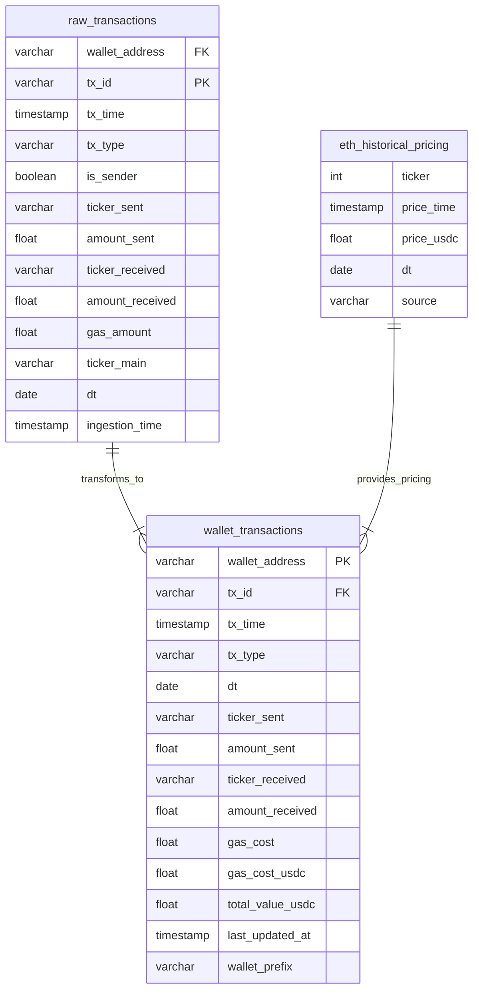
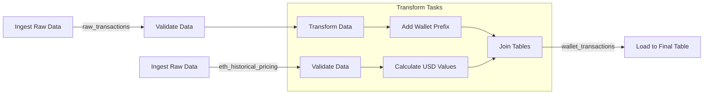

# Data Project Specification

## Project Overview
- **Project Name**: Wallet Transaction Accounting Tool
- **Description**: A comprehensive tool designed to simplify the accounting of Ethereum-based transactions, including detailed tracking of gas fees. This project allows users to accurately calculate the cost basis, track proceeds, and categorize expenses associated with buying, selling, and transferring assets on the Ethereum blockchain for easy export for accountants.
- **Owner**: Johnny Chan
- **Last Updated**: 11/9/2024

### Source Data Schemas
```sql
-- Historical/Accurate Pricing
CREATE TABLE eth_historical_pricing (
    ticker INT,
    price_time TIMESTAMP(0),
    price_usdc FLOAT,
    dt DATE,
    source VARCHAR
)
WITH (
    format = 'PARQUET',
    partitioning = ARRAY['dt']
)
```

```sql
--- Wallet Transactions
CREATE TABLE raw_transactions (
    wallet_address VARCHAR,
    tx_id VARCHAR PRIMARY,
    tx_time TIMESTAMP(0),
    tx_type VARCHAR,
    is_sender BOOLEAN,
    ticker_sent VARCHAR,
    amount_sent FLOAT,
    ticker_received VARCHAR,
    amount_received FLOAT,
    gas_amount FLOAT,
    ticker_main VARCHAR,
    dt DATE,
    ingestion_time TIMESTAMP(0)  -- Add processing metadata
)
WITH (
    format = 'PARQUET',
    partitioning = ARRAY['dt', 'ticker_main']
)
```

### Transformed Data Schemas
```sql
-- Final Schema
CREATE TABLE wallet_transactions (
    wallet_address VARCHAR,
    tx_id VARCHAR,           -- Add to trace back to raw
    tx_time TIMESTAMP(0),
    tx_type VARCHAR,
    dt DATE,
    ticker_sent VARCHAR,
    amount_sent FLOAT,
    ticker_received VARCHAR,
    amount_received FLOAT,
    gas_cost FLOAT,
    gas_cost_usdc FLOAT,
    total_value_usdc FLOAT,
    last_updated_at TIMESTAMP(0),
    wallet_prefix VARCHAR -- 0xXX
)
WITH (
    format = 'PARQUET',
    partitioning = ARRAY['dt','wallet_prefix']
)
```

### Data Model Diagram


### DAG Structure


### Processing Steps
1. Raw Data Ingestion
   - Frequency: Hourly
   - Source: [Source System]
   - Target: S3 raw zone

2. Transform
   - Aggregations
   - Enrichments
   - Calculations

3. Quality Checks
   - Schema validation
   - Business rule validation
   - Data quality metrics

## 4. Data Quality Framework
### 4.1 Quality Metrics
```python
quality_checks = {
    'completeness': {
        'missing_values': 'count(case when col is null then 1 end) / count(*)',
        'empty_strings': 'count(case when col = "" then 1 end) / count(*)'
    },
    'accuracy': {
        'value_range': 'count(case when value between 0 and 100 then 1 end) / count(*)',
        'valid_categories': 'count(case when category in ("A", "B", "C") then 1 end) / count(*)'
    },
    'timeliness': {
        'processing_lag': 'avg(timestamp_diff(process_time, event_time, HOUR))'
    }
}
```

### 4.2 Quality Thresholds
| Metric | Threshold | Severity |
|--------|-----------|----------|
| Missing Values | < 5% | Critical |
| Value Range | > 95% | Warning |
| Processing Lag | < 2 hours | Critical |

## 5. Infrastructure
### 5.1 Storage
- Raw Zone: `s3://bucket/raw/`
- Processed Zone: `s3://bucket/processed/`
- File Format: Parquet
- Partitioning Strategy: Daily partitions

### 5.2 Processing
- Engine: Spark/Trino
- Resource Configuration:
  ```yaml
  spark:
    executor.instances: 4
    executor.memory: 8g
    executor.cores: 4
  ```

## 6. Monitoring
### 6.1 SLAs
- Data Freshness: < 3 hours
- Pipeline Duration: < 1 hour
- Quality Score: > 95%

### 6.2 Alerts
| Alert | Condition | Channel |
|-------|-----------|---------|
| Late Data | lag > 3 hours | Slack #data-alerts |
| Quality Failed | score < 95% | Email + Slack |
| Pipeline Failed | status = 'FAILED' | PagerDuty |

## 7. Testing Strategy
### 7.1 Unit Tests
```python
def test_data_quality():
    # Test completeness
    assert check_missing_values(df) < 0.05
    # Test accuracy
    assert check_value_ranges(df) > 0.95
```

### 7.2 Integration Tests
- End-to-end pipeline validation
- Cross-system data consistency
- Performance benchmarks

## 8. Dependencies
- External Systems
- APIs
- Libraries
- Credentials

## 9. Runbook
### 9.1 Pipeline Operation
```bash
# Example commands
spark-submit job.py --date 2024-01-01
```

### 9.2 Troubleshooting
- Common Issues
- Resolution Steps
- Support Contacts
